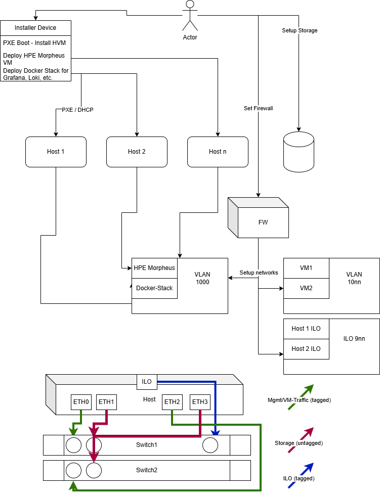

# HPE HVM PXE Deployment

Automatisierte PXE-Installation des HPE HVM Hypervisors (Ubuntu-basiert) mit interaktiver Netzwerkkonfiguration, Bond/VLAN-Setup und Post-Install-Skripten.

## Übersicht

```
┌─────────────────┐     DHCP/TFTP/HTTP      ┌──────────────────┐
│  Ziel-Server    │ ◄────────────────────── │  PXE-Server      │
│  (HPE Hardware) │                         │  (Linux/WSL)     │
└────────┬────────┘                         └────────┬─────────┘
         │                                           │
         │  1. iPXE Boot → Parameter abfragen        │
         │  2. Autoinstall (user-data)               │
         │  3. Installation auf /dev/sda             │
         │  4. Post-Install Skripte in /root/      │
         └───────────────────────────────────────────┘
```

## Voraussetzungen

### PXE-Server
- Linux (empfohlen: dedizierte VM) oder WSL2 mit bridged Networking
- Root/sudo-Zugang
- HPE HVM ISO-Datei
- Netzwerkinterface im gleichen Segment wie die Ziel-Hosts

### WSL-Hinweis
WSL2 kann als PXE-Server dienen, erfordert aber:
- Bridged Networking (nicht standard NAT)
- Deaktivierte Windows-Firewall für DHCP-Ports (67/68 UDP)
- Oft ist eine **dedizierte Linux-VM** die zuverlässigere Wahl

### Ziel-Server
- PXE/Network Boot im BIOS/UEFI aktiviert
- Boot-Reihenfolge: Network first (einmalig)

## Schnellstart

```bash
# 1. Repository klonen / entpacken
cd hvm-pxe-deploy

# 2. HPE HVM ISO bereitstellen
mkdir -p iso installers
cp /pfad/zur/hpe-hvm.iso iso/hpe-hvm.iso
cp /pfad/zur/hpe-vm-essentials.iso installers/hpe-vm-essentials.iso

# 3. PXE-Server einrichten (interaktiv)
sudo ./pxe-server/setup-pxe-server.sh

# 4. Interface-Profil für Hosts konfigurieren
cp config/interfaces.example.yaml config/interfaces.yaml
# interfaces.yaml anpassen

# 5. Optional: Host vorab registrieren (Alternative zu iPXE-Abfrage)
sudo ./pxe-server/register-host.sh

# 6. Ziel-Server per PXE booten
```

## Projektstruktur

```
hvm-pxe-deploy/
├── config/
│   ├── interfaces.example.yaml   # Interface-Rollen (mgmt/vm/storage)
│   └── pxe-server.conf.example   # PXE-Server Einstellungen
├── iso/
│   └── hpe-hvm.iso               # HPE HVM Hypervisor ISO (von Ihnen bereitgestellt)
├── installers/
│   └── hpe-vm-essentials.iso     # HPE VM Essentials ISO (.deb + QCOW2, von Ihnen bereitgestellt)
├── pxe-server/
│   ├── setup-pxe-server.sh       # Haupt-Setup PXE/DHCP/HTTP
│   ├── extract-iso.sh            # Boot-Dateien aus ISO extrahieren
│   ├── register-host.sh          # Host manuell registrieren
│   ├── generate-autoinstall.sh   # user-data aus Template erzeugen
│   ├── prepare-host.sh           # API für iPXE (Host vorbereiten)
│   ├── templates/                # Konfigurations-Templates
│   └── ipxe/                     # iPXE Boot-Skripte
├── autoinstall/
│   └── templates/
│       └── user-data.template    # Ubuntu Autoinstall Vorlage
└── post-install/                 # Werden nach Installation nach /root/ kopiert
    ├── 00-configure-mgmt-network.sh
    ├── 01-configure-storage-interfaces.sh
    ├── 02-configure-iscsi-iqn.sh
    ├── 03-configure-multipath-iscsi.sh
    ├── 04-import-hpe-vm-essentials.sh
    ├── 05-post-install-utils.sh
    ├── 06-install-ansible.sh
    ├── 07-setup-ssh-for-ansible.sh
    ├── 08-deploy-vme-console-deb.sh
    ├── 09-deploy-ops-vm.sh
    └── ops-vm/                 # Docker Compose Stack (Syslog, Grafana, Prometheus)
```

## Dateien bereitstellen

| Datei | Im Projekt | Auf dem PXE-Server (nach Setup) | Auf dem HVM-Host (Post-Install) |
|-------|------------|----------------------------------|----------------------------------|
| HVM Hypervisor ISO | `iso/hpe-hvm.iso` | verlinkt unter `/var/www/hvm-pxe/iso/` | — |
| HPE VM Essentials | `installers/hpe-vm-essentials.iso` | `/var/www/hvm-pxe/assets/installers/` | `/root/installers/` (optional) |

**HPE VM Essentials** wird als **ISO** geliefert (keine OVA). Die ISO enthält:
- `hpe-vm_*.deb` — VM Essentials Console (auf **jedem** HVM-Host installieren)
- `hpe-vme-*.qcow2(.gz)` — Manager-VM Image (nur auf **einem** Host)

Drei Wege, die ISO bereitzustellen:

1. **Im Projekt ablegen** (empfohlen): `installers/hpe-vm-essentials.iso`
2. **Per HTTP vom PXE-Server**: `http://<pxe-server>/assets/installers/hpe-vm-essentials.iso`
3. **Direkt auf dem HVM-Host**: z.B. `/root/installers/hpe-vm-essentials.iso`

## Ablauf der Installation

### Phase 1: PXE-Boot (interaktiv via iPXE)
Beim Netzwerk-Boot werden folgende Parameter abgefragt:
- Hostname
- IP-Adresse (Management)
- Subnetzmaske
- Gateway
- VLAN-ID
- Interface-Profil (aus `config/interfaces.yaml`)

### Phase 2: Automatische OS-Installation
- Ubuntu Autoinstall (Subiquity)
- Vollständige Nutzung von `/dev/sda`
- Hostname und Basis-Netzwerk werden gesetzt
- Post-Install-Skripte werden nach `/root/post-install/` kopiert
- Parameter werden in `/root/install-params.env` gespeichert

### Phase 3: Post-Install (manuell oder via `run-all-post-install.sh`)
Nach dem ersten Login als root:

```bash
cd /root/post-install
./run-all-post-install.sh          # Alle Skripte nacheinander
# oder einzeln:
./00-configure-mgmt-network.sh     # Bond + VLAN für Management
./01-configure-storage-interfaces.sh
./02-configure-iscsi-iqn.sh
./03-configure-multipath-iscsi.sh
./04-import-hpe-vm-essentials.sh
./05-post-install-utils.sh
./06-install-ansible.sh
./07-setup-ssh-for-ansible.sh
./08-deploy-vme-console-deb.sh    # hpe-vm .deb auf allen Cluster-Hosts
./09-deploy-ops-vm.sh             # Ops-VM: Syslog + Grafana + Prometheus
```

### Ansible (Script 6 + 7)

Script 6 installiert Ansible unter `/root/ansible/`, legt interaktiv ein Inventory an und erstellt ein Ping-Test-Playbook.

Script 7 richtet SSH-Keys ein, trägt Remote-Hosts in `known_hosts` ein, verteilt den Public Key per `ssh-copy-id` und testet optional mit dem Ping-Playbook.

```bash
cd /root/post-install
./06-install-ansible.sh          # zuerst: Ansible + Inventory
./07-setup-ssh-for-ansible.sh    # danach: SSH-Keys + Ping-Test

cd /root/ansible
ansible-playbook playbooks/ping.yml
```

### VM Essentials .deb auf alle Hosts (Script 8)

Script 4 extrahiert die ISO und installiert die `.deb` **nur lokal**. Für den gesamten Cluster:

```bash
cd /root/post-install
./08-deploy-vme-console-deb.sh
```

Das Skript installiert `hpe-vm_*.deb` lokal und auf Remote-Hosts (via Ansible-Inventory oder manuelle Eingabe). Empfohlene Reihenfolge: Script 4 → 6 → 7 → **8**.

### Ops-VM: Syslog + Monitoring (Script 9)

Erstellt eine KVM-VM im **gleichen Management-Netz** wie der Host (macvtap auf `bond0.<VLAN>`), mit höherer IP-Adresse (interaktiv, Vorschlag: Host-IP + 10).

**Docker Compose Stack in der VM:**

| Container | Funktion | Port |
|-----------|----------|------|
| syslog-ng | Zentraler Syslog-Server (persistentes Volume) | 514/tcp, 514/udp |
| **Loki** | Log-Aggregation & Speicher (30 Tage Retention) | 3100 |
| **Promtail** | Liest syslog-ng-Dateien → push an Loki | — |
| Prometheus | Metriken | 9090 |
| Grafana | Dashboards + **Log-Analyse** (Loki Datasource) | 3000 |
| Alertmanager | Alert-Routing | 9093 |

**Log-Pipeline:**

```
HVM-Hosts (rsyslog) → syslog-ng → Promtail → Loki → Grafana
```

Log-Analyse in Grafana unter **Ops → HVM Syslog Analyse** oder **Explore** mit LogQL, z.B. `{job="syslog"}`, `{job="syslog", host="hvm01"}`.

**Metriken-Dashboard:** **Ops → HVM Host Metriken** — CPU, RAM, Disk, Netzwerk, Load, Uptime (Daten von `node_exporter` via Prometheus). Voraussetzung: `node_exporter` auf den HVM-Hosts (Script 9, Ansible-Playbook `install-node-exporter.yml`). Targets prüfen: `http://<ops-vm-ip>:9090/targets`.

Script 9 konfiguriert **rsyslog-Forwarding** und **node_exporter** standardmäßig via **Ansible** auf allen Hosts im Inventory (`hosts: all` — inkl. localhost). Voraussetzung: Script 6 (Inventory) und Script 7 (SSH-Keys). Bei fehlendem Ansible/Inventory: Fallback per direktem SSH.

Playbooks: `post-install/ops-vm/ansible/configure-rsyslog-forward.yml`, `install-node-exporter.yml`

```bash
cd /root/post-install
./09-deploy-ops-vm.sh    # nach Script 7 (SSH-Keys empfohlen)
```

Konfiguration: `/root/config/ops-vm.env`

## Interface-Konfiguration

In `config/interfaces.yaml` werden pro Profil die Interface-Rollen definiert:

```yaml
profiles:
  default:
    mgmt:        # Werden zu bond0 zusammengefasst
      - eno1
      - eno2
    vm_traffic:  # Für spätere VM-Netzwerk-Konfiguration
      - ens1f0
      - ens1f1
    storage:     # Werden in Post-Install Script 1 konfiguriert
      - ens2f0
      - ens2f1
```

## DHCP/IP-Bereich

Der Setup-Assistent konfiguriert dnsmasq mit:
- DHCP-Range für PXE-Clients
- TFTP-Root für Boot-Dateien
- Proxy-DHCP oder authoritative DHCP (je nach Umgebung)
- iPXE Chainloading

## Fehlerbehebung

| Problem | Lösung |
|---------|--------|
| Kein DHCP Offer | Firewall prüfen, dnsmasq-Logs: `journalctl -u dnsmasq` |
| TFTP timeout | `tftp`-Test: `atftp --get -r pxelinux.0 -l /tmp/test <server-ip>` |
| Autoinstall startet nicht | HTTP erreichbar? `curl http://<server>/hosts/<hostname>/user-data` |
| ISO nicht gefunden | Pfad in `config/pxe-server.conf` prüfen, `extract-iso.sh` erneut ausführen |

## Schema-Zeichnung Zielarchitektur



Die Zeichnung zeigt den **Gesamtaufbau** aus Installation, Plattform-Schicht und physischem Netzwerk. Im Projekt mappt sich das wie folgt:

### Bereitstellung (oben)

- **Installer Device → PXE / DHCP → Host 1, Host 2, Host n**  
  Der zentrale Installations-Server (dieses Projekt: `setup-pxe-server.sh`) bootet alle HVM-Hosts per Netzwerk, verteilt per DHCP/IPXE die Installationsparameter und spielt das Betriebssystem automatisiert ein.

- **Setup Storage**  
  Anbindung an externes Storage (iSCSI/Fibre Channel). Umgesetzt in den Post-Install-Skripten `01-configure-storage-interfaces.sh`, `02-configure-iscsi-iqn.sh` und `03-configure-multipath-iscsi.sh`.

- **Set Firewall → FW**  
  Optionale Firewall-Härtung auf den Hosts (`05-post-install-utils.sh`, UFW).

### Plattform & Virtualisierung (Mitte)

- **HPE Morpheus / Docker-Stack**  
  HPE VM Essentials als Management-/Virtualisierungs-Plattform (`04-import-hpe-vm-essentials.sh`, `08-deploy-vme-console-deb.sh`) sowie der **Ops-VM Docker-Stack** (`09-deploy-ops-vm.sh`: Syslog, Loki, Prometheus, Grafana).

- **VM1, VM2**  
  Virtuelle Maschinen auf den HVM-Hosts — u.a. die VM-Essentials-Manager-VM und die Ops-/Monitoring-VM.

- **Setup networks**  
  Netzwerk-Konfiguration pro Host: Bonds, VLANs, Storage- und VM-Traffic-Interfaces (`00-configure-mgmt-network.sh`, `01-configure-storage-interfaces.sh`, `05-post-install-utils.sh`).

- **Host 1 ILO / Host 2 ILO**  
  Dedizierte Out-of-Band-Management-Ports der HPE-Server (Hardware-Management, unabhängig vom OS).

### Physisches Netzwerk (unten)

Ein **Host** ist redundant an **Switch 1** und **Switch 2** angebunden:

| Farbe / Legende | Interface(s) | Traffic-Typ | Im Projekt |
|-----------------|--------------|-------------|------------|
| Grün — Mgmt/VM-Traffic (tagged) | ETH0, ETH2 | Management + VM-Netzwerk, getaggt | `mgmt` + `vm_traffic` in `config/interfaces.yaml`, Bond + VLAN in Script `00` |
| Rot — Storage (untagged) | ETH1, ETH3 | Storage/iSCSI, untagged | `storage` in `config/interfaces.yaml`, Script `01` |
| Blau — ILO (tagged) | ILO | Out-of-Band-Management | Separates Hardware-Management, nicht Teil der OS-Konfiguration |

Jedes Dateninterface (ETH0–ETH3) ist **jeweils an beide Switches** verbunden — typisches redundantes Design mit Bonding und getrennten Netzwerkdomänen für Management, VM-Traffic und Storage.

## Lizenz

MIT
